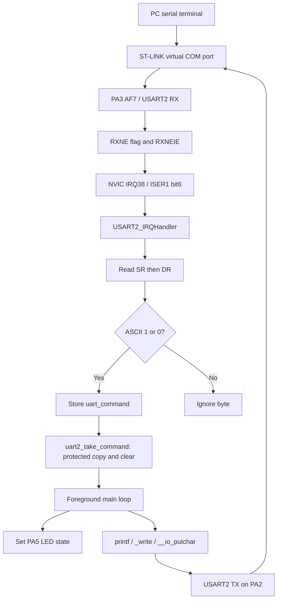

# UART Receive Interrupt LED Control — NUCLEO-F446RE

[EXTI and NVIC projects](../README.md) · [Platform overview](../../README.md)

Control the Nucleo's LD2 LED by sending ASCII commands from a serial terminal. Receiving `1` turns the LED on; receiving `0` turns it off. USART2 captures each received byte in an interrupt, while the foreground loop handles LED updates and serial acknowledgements.

This project uses direct register access and GCC inline assembly, without CMSIS or HAL. It belongs to the NVIC learning exercises in this folder: its interrupt source is **USART2 RXNE**, not a GPIO EXTI line. The B1 button is not used.

## Hardware and serial connection

- Board: **NUCLEO-F446RE**, STM32F446RE, Cortex-M4.
- LED: onboard **LD2 on PA5**, active high; initialized off.
- USART2 TX: **PA2, alternate function AF7**.
- USART2 RX: **PA3, alternate function AF7**.
- PC connection: the board's **ST-LINK USB virtual COM port**, using the board's default USART2 solder-bridge routing.
- Terminal: **115200 baud, 8 data bits, no parity, 1 stop bit, no hardware flow control**.

The code assumes a hardware-reset clock configuration: HSI at 16 MHz and APB1 at 16 MHz. It does not configure a PLL. With default oversampling by 16, the baud-rate calculation writes `139` (`0x008B`) to USART2 BRR. Changing the clock requires updating the baud-rate input.

## Expected behavior

After startup, the application prints:

```text
UART2 interrupt driven LED Project started
```

- Send `1`: PA5 goes high and the terminal receives `LED ON`.
- Send `0`: PA5 goes low and the terminal receives `LED OFF`.
- Other characters, including carriage return and newline, are ignored.
- With no pending command, the foreground loop produces no output.
- Repeating a command keeps the same LED state and produces another acknowledgement when that command is consumed.

Commands are ASCII characters: `'1'` is `0x31`, and `'0'` is `0x30`. Numeric zero (`0U`) is reserved internally for “no pending command.”

## Architecture



## Execution model

### Initialization

`main()` calls `gpio_init()` to enable GPIOA, select AF7 for PA2/PA3, and configure PA5 as an output initially low. It then calls `uart_rxtx_init()` to enable the USART2 peripheral clock, configure the baud rate and frame, enable transmit and receive, enable RXNE interrupts, and enable USART2 in the NVIC.

USART2 is external interrupt **38**. Its NVIC register index is `38 / 32 = 1`, and its bit position is `38 % 32 = 6`. The code writes `1U << 6` to ISER1, a write-one-to-set register.

### Interrupt handler

`USART2_IRQHandler()` checks RXNE in the status register and reads the received byte from the data register. Reading DR clears RXNE. Only `'1'` and `'0'` are stored in the shared `volatile uint32_t uart_command` variable. The handler does not print or manipulate the LED.

### Safe command handoff

`uart2_take_command()` saves PRIMASK, briefly masks interrupts with `cpsid i`, copies the shared command, clears it to `0U`, and restores the saved PRIMASK. It returns the local copy to `main()`.

The protected copy-and-clear prevents an interrupt from storing a new command between those two statements and having it erased. Restoring the saved state also preserves a caller's existing interrupt masking. The inline assembly uses a `memory` clobber to keep the compiler from moving the protected memory accesses across these boundaries.

### Foreground processing

The busy-polling main loop takes one pending command at a time, sets or clears PA5, and prints the acknowledgement. `printf()` reaches `_write()` in `syscalls.c`, which calls `__io_putchar()`. That function waits for TXE and writes each character to USART2 DR. LED handling and serial output occur after the protected handoff, with the previous interrupt state restored.

## Source layout

```text
002_uart_rx_interrupt_led/
├── Inc/
│   ├── stm32f446xx_reg.h       # Memory-mapped register definitions
│   ├── gpio.h                 # GPIO interface and pin definitions
│   └── uart.h                 # UART interface, IRQ mask and clock constants
├── Src/
│   ├── main.c                 # Initialization and foreground command handling
│   ├── gpio.c                 # PA2/PA3 configuration and PA5 LED control
│   ├── uart.c                 # UART setup, RX ISR, mailbox handoff and TX
│   ├── syscalls.c             # Standard-library I/O retargeting
│   └── sysmem.c               # Standard-library heap support
├── Startup/
│   └── startup_stm32f446retx.s # Reset handler and interrupt vector table
├── STM32F446RETX_FLASH.ld     # Flash build: 512 KB flash, 128 KB SRAM
├── STM32F446RETX_RAM.ld       # Alternative linker script; not the default build
├── .project
├── .cproject
└── 002_uart_rx_interrupt_led.launch
```

## Build and run

1. Clone or download the repository.
2. In STM32CubeIDE, select **File → Import → General → Existing Projects into Workspace** and select this project directory.
3. Confirm the project is `002_uart_rx_interrupt_led`, targets STM32F446RE, and uses the included F446 startup and flash linker script.
4. Select **Project → Clean**, then build the Debug configuration. CubeIDE generates the build files and output directory.
5. Connect the Nucleo through its ST-LINK USB connector. Flash/debug using `002_uart_rx_interrupt_led.launch`, then resume execution if the debugger stops at `main()`.
6. Open the ST-LINK serial port at 115200 8N1 with no flow control. Reset the board after opening the terminal to see the startup message.
7. Send `1` and `0` individually. Some terminals transmit only after Enter; the additional CR/LF characters are ignored.

Build output and unrelated launch profiles are excluded from this repository copy. Its Debug and Release build paths refer to this project.

## Manual verification

- [ ] Reset: LD2 is off and the startup message appears once.
- [ ] Send `1`: LD2 turns on and `LED ON` appears once.
- [ ] Send `1` again: LD2 stays on and another acknowledgement appears.
- [ ] Send `0`: LD2 turns off and `LED OFF` appears once.
- [ ] Send `x`, Enter, or a space: LED state remains unchanged, with no acknowledgement.
- [ ] Leave the terminal idle: no repeated output appears.

## Current limits and next exercises

- **One pending command:** this is a mailbox, not a queue. A newer valid command can replace an older one before the main loop takes it. Invalid characters do not overwrite it. Use a ring buffer if every received command must be preserved.
- **Blocking transmission:** RX uses interrupts, but TX polls TXE. The ISR can still capture input while the foreground prints, subject to the mailbox limit.
- **Receive errors:** the handler reads SR then DR on the RXNE path, but does not explicitly classify, count, or reject overrun/framing/noise errors, or implement an error-only recovery path. Explicit error handling is a useful next exercise.
- **Reset assumptions:** initialization relies on reset defaults for parity, oversampling and flow control. This is a reset-started learning application, not a reusable reinitialization driver.

## References

- [STM32F446 reference manual RM0390](https://www.st.com/resource/en/reference_manual/dm00135183.pdf): RCC, GPIO and USART registers.
- [Cortex-M4 programming manual PM0214](https://www.st.com/resource/en/programming_manual/pm0214-stm32-cortexm4-mcus-and-mpus-programming-manual-stmicroelectronics.pdf): NVIC, PRIMASK, MRS, MSR and CPS instructions.
- [Nucleo-64 user manual UM1724](https://www.st.com/resource/en/user_manual/dm00105823.pdf): board routing and ST-LINK virtual COM port.
- [GCC extended assembly](https://gcc.gnu.org/onlinedocs/gcc/Extended-Asm.html): operands, volatile assembly and memory clobbers.
