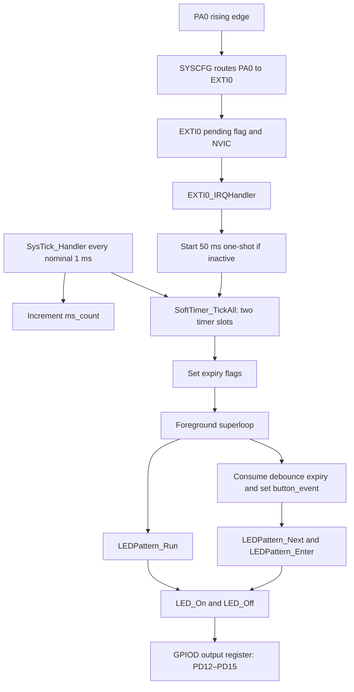

# EXTI 01 — Interrupt-Driven Button and LED Pattern Controller

[EXTI and NVIC overview](../README.md)

A register-level STM32F407VG application that uses a button interrupt to switch LED patterns. EXTI0 detects the button edge, SysTick advances two software timers, and the foreground loop applies LED state changes. The application uses no RTOS, HAL driver layer, heap-based event queue, or blocking delay in its main loop.

This README describes the current source, including its limitations, rather than a proposed architecture.

## Hardware and clock assumptions

- **Target:** STM32F407VG / STM32F4 Discovery configuration.
- **Button:** PA0, routed through SYSCFG to EXTI0, rising-edge trigger. GPIO input pulls are disabled; the code assumes the board supplies the required external bias.
- **LEDs:** PD12 green, PD13 orange, PD14 red, PD15 blue. GPIO initialization configures low-speed outputs, disables pulls, and clears their output bits.
- **Time base:** SysTick uses the processor clock, reload value `15999`, and interrupts. The intended 1 ms tick assumes a 16 MHz core clock; the application does not configure a PLL or otherwise establish that frequency in `main()`.
- **Interrupts:** EXTI0 is enabled through NVIC ISER0 bit 6. SysTick interrupts are enabled through its control register. The application does not explicitly program interrupt priorities.

## Architecture



### Source responsibilities

- [`Src/main.c`](Src/main.c): initialization order, `SysTick_Handler()`, `ms_count`, and the foreground superloop.
- [`Src/gpio.c`](Src/gpio.c): GPIOA/GPIOD clock enables, button input, and LED output setup.
- [`Src/interrupt.c`](Src/interrupt.c): SYSCFG routing, EXTI rising-edge/unmask setup, NVIC enable, and `EXTI0_IRQHandler()`.
- [`Src/soft_timer.c`](Src/soft_timer.c) and [`Inc/soft_timer.h`](Inc/soft_timer.h): two statically allocated timer records and start/stop/restart/tick/expiry operations.
- [`Src/led_pattern.c`](Src/led_pattern.c): pattern state, current LED, alternating phase, and pattern transitions.
- [`Src/led.c`](Src/led.c): LED pin operations through GPIOD ODR read-modify-write accesses.
- [`Inc/stm32f407xx_reg.h`](Inc/stm32f407xx_reg.h): application register definitions.
- `Startup/`, the linker scripts, and CubeIDE metadata: vector table, startup, memory layout, build, and debug configuration.

## Execution model

### 1. Startup

`main()` performs these steps in order:

1. Call `GPIO_Init()` and initially clear all four LED outputs.
2. Call `EXTI0_Init()` to route PA0, enable rising-edge detection, clear the pending bit with a write-one-to-clear operation, and enable the NVIC interrupt.
3. Configure and enable SysTick with its interrupt and processor-clock source.
4. Start `TIMER_PATTERN` as a periodic 500-tick timer.
5. Call `LEDPattern_Init()`, which clears all LEDs and turns green on.
6. Enter the continuously running `while (1)` loop.

The initial pattern variable is **alternating**, even though startup illuminates only green. The first pattern expiry enters the orange/blue phase.

### 2. EXTI0 interrupt: capture an edge and start the lockout

`EXTI0_IRQHandler()` checks EXTI0's pending bit and clears it by writing `1`. If the debounce timer is inactive, it starts `TIMER_BUTTON_DEBOUNCE` as a 50-tick one-shot. Further edges while that timer is active are acknowledged but do not restart or extend the window.

The handler does not change LED patterns or set `button_event`. It delegates the delayed response to the software timer and foreground loop.

### 3. SysTick interrupt: maintain timing

`SysTick_Handler()` increments `ms_count`, then calls `SoftTimer_TickAll()` for the two timer slots. `ms_count` is a diagnostic tick counter; the software timers maintain their own counters.

For each active timer, the tick function increments its counter. At expiry it clears the counter and sets `expired = 1`. A one-shot becomes inactive; a periodic timer stays active and starts counting its next interval.

- **Pattern timer:** periodic, 500 ticks, nominally 500 ms.
- **Button debounce timer:** one-shot, 50 ticks, nominally 50 ms.

The ISR advances timer state and sets flags; it does not run LED-pattern transitions or callbacks. Work per tick is bounded by the fixed two-slot scan.

### 4. Foreground loop: consume flags and update outputs

Every iteration performs these operations in this exact order:

1. `LEDPattern_Run()` checks and consumes the pattern expiry when the current mode requires animation.
2. `SoftTimer_Expired()` checks the debounce timer and clears its expiry flag if set. On success, the loop sets `button_event = 1`.
3. If `button_event` is set, the loop clears it and calls `LEDPattern_Next()`, which selects the next mode and calls `LEDPattern_Enter()`.

`button_event` is produced and consumed in the foreground; the EXTI handler does not write it. Its current role is a foreground dispatch flag, not an ISR-to-main event queue.

The loop performs cooperative, non-blocking work but continuously polls the flags. There is no `WFI` sleep, scheduler, or task switching. If pattern and debounce expiry are both pending, the old pattern gets its update before the button transition is processed.

## LED state machine

Button events cycle through:

```text
ALTERNATING → RUNNING → ALL_ON → ALL_OFF → ALTERNATING → …
```

- **Running:** every consumed pattern expiry turns the current LED off, advances green → orange → red → blue → green, and requests the next LED on.
- **All on:** entry requests all four LEDs on; the run function performs no periodic work.
- **All off:** entry clears all four LEDs; the run function performs no periodic work.
- **Alternating:** each consumed expiry switches between orange/blue and green/red requests.

On each mode change, `LEDPattern_Enter()` first turns all LEDs off, resets the current LED to green and alternating phase to zero, then applies the selected mode's entry outputs.

**Current visible difference:** `LED_On(LED_RED)` has its register write commented out in `Src/led.c`. Consequently, the running sequence has a dark red slot, all-on lights green/orange/blue only, and the green/red alternating phase lights only green. The mode names describe the requested pattern; this source does not currently illuminate red through `LED_On()`.

## Timing, debounce, and shared-state behavior

- **Debounce is a lockout, not a stability check.** The first accepted rising edge starts a fixed window. Expiry produces a button event without rereading PA0, even if the button has already been released. Additional edges after the window can start another event. Release-edge detection is not configured by this application.
- **Nominal timing depends on the clock and service latency.** The 50/500 values count SysTick interrupts. The first increment can occur shortly after timer start; foreground handling follows when the loop observes expiry.
- **Pattern timing is not restarted on mode changes.** The periodic timer keeps running, including in all-on/all-off modes. Those modes do not consume its expiry, so returning to an animated mode can cause an immediate step rather than a fresh 500 ms wait.
- **Expiry is a flag, not a count.** Multiple expirations collapse into one pending indication when the foreground is delayed. There is no event backlog or catch-up execution.
- **`volatile` does not provide synchronization.** Timer records are shared between interrupts and the foreground. Multi-field timer setup and the read/clear expiry operation are not protected by critical sections. For example, a new EXTI edge after one-shot expiry can restart the inactive debounce timer and clear an expiry the foreground has not consumed yet. The implementation should not be described as lossless or race-free.
- **LED state belongs to the foreground after initialization.** Both interrupt handlers avoid LED output writes. The LED driver nevertheless uses ODR read-modify-write operations rather than atomic BSRR updates.

## Build and run

1. Import this directory as an existing STM32CubeIDE project named `exti_01_button_interrupt`.
2. Confirm the STM32F407VG target, board wiring, and clock assumption.
3. Build the Debug or Release configuration.
4. Select `exti_01_button_interrupt.launch` and use a connected ST-LINK to flash/debug the board.
5. Observe the startup green LED and alternating animation. An accepted button edge should advance the mode after the nominal 50 ms lockout, subject to the current timing and concurrency limitations above.

The folder includes headers, source, startup assembly, flash/RAM linker scripts, and CubeIDE configuration. Generated build files are excluded.

## Suggested validation on hardware

- Inspect EXTI0 pending-bit clearing and verify that repeated edges inside an active debounce window do not restart it.
- Measure the SysTick interval and the 500-tick animation interval against the actual clock.
- Exercise all four modes and compare the outputs with the documented red-LED limitation.
- Leave the application in a static mode, then switch back to animation and observe retained timer phase/expiry.
- Test rapid button activity and delayed foreground servicing to characterize event coalescing.

This description was checked against the source. It does not claim a new firmware build, timing measurement, or hardware validation. The README update does not change application behavior.
