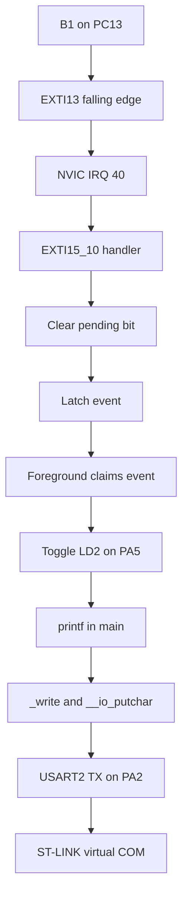

# PC13 Button Interrupt with LED and UART Output

`exti_02_pc13_button_uart` is a register-level interrupt example for the **NUCLEO-F446RE**. A falling edge from the onboard B1 button on PC13 triggers EXTI13. The interrupt handler acknowledges the request and records an event; the foreground loop consumes that event, toggles LD2 on PA5, and prints a message through USART2.

The example demonstrates GPIO-to-EXTI routing, direct NVIC enable, a short interrupt handler, and safe event transfer to foreground code. Peripheral configuration uses memory-mapped registers, and interrupt masking uses ARM instructions without CMSIS helper calls or HAL drivers.

## Hardware and clock assumptions

- **MCU:** STM32F446RE, Cortex-M4; 512 KB flash and 128 KB SRAM.
- **Input:** B1 on PC13, falling-edge detection. PC13 uses the board's button bias; the firmware disables its internal pull-up/down.
- **Output:** LD2 on PA5, initialized off and toggled for each consumed event.
- **Serial:** USART2 TX on PA2, alternate function AF7, routed to the onboard ST-LINK virtual COM port with the board's default routing.
- **Terminal:** 115200 baud, 8 data bits, no parity, 1 stop bit, no flow control.
- **Clock:** reset-default HSI at 16 MHz, with APB1 also at 16 MHz. The application does not configure a PLL. `APB1_CLOCK` in `Inc/uart.h` must match the actual peripheral clock if the clock configuration changes.

## Architecture



The startup vector table connects the shared EXTI10–15 interrupt to `EXTI15_10_IRQHandler()`. This project enables and handles EXTI13 only.

### Source map

- [`Src/main.c`](Src/main.c): initialization order, startup message, and foreground event loop.
- [`Src/gpio.c`](Src/gpio.c): PA2 alternate function, PC13 input, and PA5 LED configuration.
- [`Src/exti.c`](Src/exti.c): EXTI/NVIC setup, interrupt handler, and event-claim helper.
- [`Src/uart.c`](Src/uart.c): USART2 baud rate and transmit configuration; `__io_putchar()`.
- [`Src/syscalls.c`](Src/syscalls.c): C library `_write()` retarget to UART; [`Src/sysmem.c`](Src/sysmem.c) supplies heap support.
- [`Inc/`](Inc/): driver interfaces, bit definitions, and the custom `stm32f446xx_reg.h` register map.
- [`Startup/startup_stm32f446retx.s`](Startup/startup_stm32f446retx.s): reset entry and interrupt vector table.
- [`STM32F446RETX_FLASH.ld`](STM32F446RETX_FLASH.ld): flash build memory layout. The RAM linker script is also included.
- `.project`, `.cproject`, and `exti_02_pc13_button_uart.launch`: CubeIDE project, build, and debug configuration.

## Execution model

### Startup

`main()` calls `gpio_init()`, then `uart_tx_init()`. It disables stdout buffering with `setvbuf()` before calling `exti_pc13_init()`, prints the ready message, and enters its continuous foreground loop.

EXTI initialization enables the SYSCFG clock, masks EXTI13 while configuring it, and writes port code `2` into `SYSCFG_EXTICR4[7:4]` to select PC13. The masked write preserves the port selections for EXTI12, EXTI14, and EXTI15. It disables rising-edge detection, enables falling-edge detection, clears any stale EXTI13 pending flag, and unmasks the line.

Finally, it enables **IRQ 40** by writing bit **8** of `NVIC_ISER1`: `40 / 32 = 1` and `40 % 32 = 8`. EXTI line 13 and NVIC IRQ 40 are different identifiers. ISER uses write-one-to-set behavior, so the direct assignment preserves other interrupt enables.

### Interrupt and foreground work

The handler checks EXTI13's pending bit, clears it by writing one to `EXTI_PR` bit 13, and sets `exti13_event = 1`. It performs no printing or LED updates.

`exti13_take_event()` saves PRIMASK, briefly masks interrupts, reads and clears the shared flag, and restores the saved PRIMASK. This makes claiming the event indivisible with respect to the EXTI handler and preserves the caller's previous interrupt state. The flag is defined once in `exti.c` and declared `extern volatile` in `exti.h`.

After claiming an event, `main()` toggles the LED and prints. Each character travels through `printf()` → `_write()` → `__io_putchar()`, which waits for USART2's TXE flag before writing its data register. UART output blocks foreground execution; it runs outside the helper's protected section, allowing interrupts during transmission.

## Build and run

1. Clone or download the repository and open STM32CubeIDE.
2. Use **File → Import → General → Existing Projects into Workspace**, select this folder, and import `exti_02_pc13_button_uart`.
3. Select the **Debug** build configuration, clean the project, and build. The output is `Debug/exti_02_pc13_button_uart.elf`.
4. Connect the board's ST-LINK USB connector. Use `exti_02_pc13_button_uart.launch` in **Run → Debug Configurations** to flash and debug through ST-LINK/SWD. Resume execution if the debugger stops at `main()`.
5. Open the ST-LINK serial port using the settings above, then reset the board to see the startup message. Press B1 to trigger LED and serial activity.

Expected serial text:

```text
NUCLEO-F446RE ready: press B1 (PC13).
EXTI13 event: LD2 (PA5) toggled.
```

The second line is printed for each event consumed by the foreground loop. Both messages use CRLF line endings.

## Behavior and limitations

The imported project builds without warnings using the bundled ARM GCC toolchain. Symbol and vector checks confirm IRQ 40 resolves to the EXTI handler, with the UART retarget and event-claim helper linked.

The project owner confirmed the original project working on a **NUCLEO-F446RE on 2026-09-28**.

There is no button debounce: one physical press may produce several edges and LED toggles. The event flag is a one-bit latch, so multiple interrupts before the next claim coalesce into one event. It does not count every edge. Clearing the flag before printing prevents a later interrupt during printing from being erased by a final foreground clear.

The main loop busy-polls; there is no RTOS, sleep mode, timer-based debounce, UART receive path, or transmit queue. UART polling has no timeout. If additional EXTI10–15 lines are enabled, extend the shared handler to service their pending flags.
